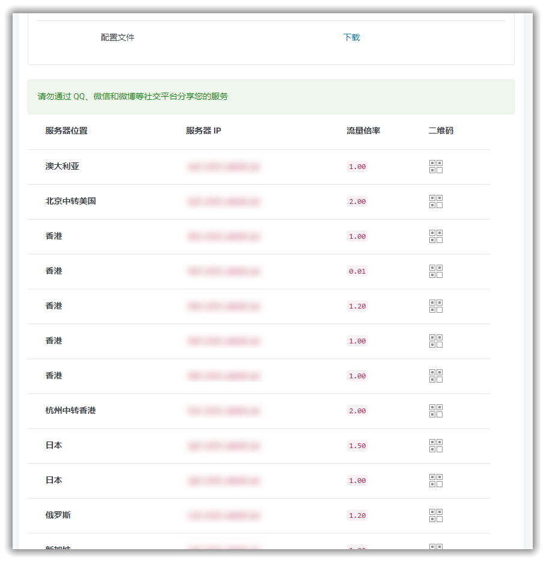
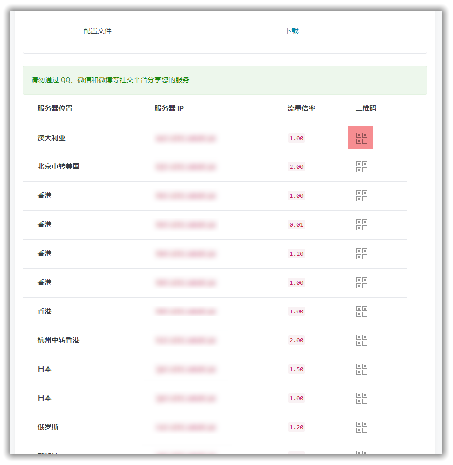

# 如何使用我们的[网站](https://portal.shadowsocks.nu)

## 快速检索
* [不同版本的区别](#版本区别)
* [注册与购买](#注册与购买)
* [登陆账户](#登陆账户)
* [查看节点信息](#查看节点信息)
* [下载配置文件](#下载配置文件)
* [查看节点二维码](#查看节点二维码)

## 版本区别
||[Starter](https://portal.shadowsocks.nu/cart.php?a=add&pid=33)|[Premium](https://portal.shadowsocks.nu/cart.php?a=add&pid=36)|[Ultimate](https://portal.shadowsocks.nu/cart.php?a=add&pid=34)|[IPv6 Only](https://portal.shadowsocks.nu/cart.php?a=add&pid=17)|[Enterprise](https://portal.shadowsocks.nu/cart.php?a=add&pid=9)|  
|:-:|:-:|:-:|:-:|:-:|:-:|
|价格（年付）|19.95 澳元|79.95 澳元|99.95澳元|19.95澳元|4999.95澳元|
|价格（月付）|×|×|9.95澳元|×|499.95澳元|
|服务器数量|10|13|18|9|定制|
|普通綫路|〇|〇|〇|〇||
|高级綫路|×|〇|〇|×||
|中转綫路|×|×|〇|×||
|在綫设备数量|1|5|5|1|无限制|
|流量配额（月）|50GB|50GB|50GB|50GB|无限制|
|备注|适合只偶尔 使用的用户|适合使用较频繁且有多 个设备同时使用的用户|适合对速度需 求较高的用户|**需网络支持IPv6**|**中港专綫(10Mbps) 可以定制带宽**|
|订购链接|[立即购买](https://portal.shadowsocks.nu/cart.php?a=add&pid=33)|[立即购买](https://portal.shadowsocks.nu/cart.php?a=add&pid=34)|[立即购买](https://portal.shadowsocks.nu/cart.php?a=add&pid=36)|[立即购买](https://portal.shadowsocks.nu/cart.php?a=add&pid=17)|[立即购买](https://portal.shadowsocks.nu/cart.php?a=add&pid=9)|

## 注册与购买

* 如果没有本站的账号，购买过程中将自动创建账户。
* 打开 [https://shadowsocks.nu/](https://shadowsocks.nu/)并点击 [Order Now](https://portal.shadowsocks.nu/link.php?id=5)，即可查看我们的产品列表。  

* 选择想要购买的服务后点击对应的 **立即订购** ，进入订单概观, 我们以旗舰版为例，选择付款周期后点击继续加入购物车   
  

* 进入结账界面: 
1. 可以 **确认您的订单信息** ，如果您持有优惠码，也可以在这个页面输入
2. 然后在下面新建账户部分 **填写必要的账户信息** 后创建新账户并与您的服务关联
3. 选择您方便的付款方式
4. **阅读并勾选同意我们的服务条款** 后点击右侧结账按钮前往付款页面
5. 支付账单后您的服务将会自动开通

**您可以选择希望使用的付款方式，我们当前提供的支付方式有**

- Wechat（仅支持中国境内用户）
- Alipay 支付宝国际版 （仅支持中国境内用户）
- PayPal （支持全球用户）
- BitCoin / 比特币
- 信用卡 / Credit Card  

(我们的结算货币为澳元，使用 Wechat/Alipay 可以使用人民币支付对应账单)

## 登陆账户
#### 登陆 [客户中心](https://portal.shadowsocks.nu),执行下列操作：

* 点击右上角 “登入”。  
* 填写 "Email 地址" 和 “密码” > 点击 “登入”。  

  

## 查看节点信息
#### 登陆 [客户中心](https://portal.shadowsocks.nu) ,执行下列操作：  

- 单击 “服务” > "我的服务" > 选择 "你可用的产品/服务"。
- 查看你的节点信息。

  

  

  

## 下载配置文件

#### 登陆 [客户中心](https://portal.shadowsocks.nu) ,执行下列操作：

- 单击 “服务” > "我的服务" 。

- 选择 你可用的产品/服务 > "配置文件" > "下载" > "下载 Shadowsocks Windows 版本配置文件"。

- 即可下载到一个 `gui-config.json` 的文件。

  

  

## 查看节点二维码

#### 登陆 [客户中心](https://portal.shadowsocks.nu) ,执行下列操作：

- 单击 “服务” > "我的服务" > 选择 "你可用的产品/服务"。
- 查看你的节点信息 > 点击 ”二维码“ 图标，显示二维码。

  

  

## 使用教程请参考：  
* [Windows 下安装配置 Shadowsocks 使用教程](2-windows-setup-guide-cn.md)

* [macOS 下安装配置 Shadowsocks 使用教程](3-macos-setup-guide-cn.md)

* [iOS 下安装配置 Shadowsocks 使用教程](4-ios-setup-guide-cn.md)

* [Android 下安装配置 Shadowsocks 使用教程](5-android-setup-guide-cn.md)

* [Linux 下安装配置 Shadowsocks 使用教程](6-linux-setup-guide-cn.md)

* [Firefox 设置教程](7-1-firefox-setup-guide-cn.md)

* [Chrome 设置教程](7-2-chrome-setup-guide-cn.md)
